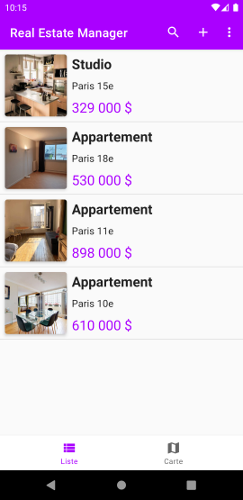
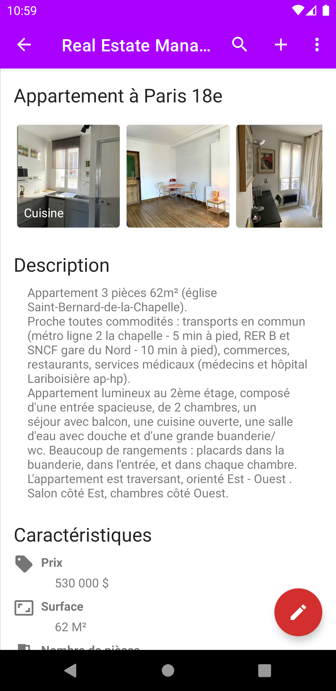
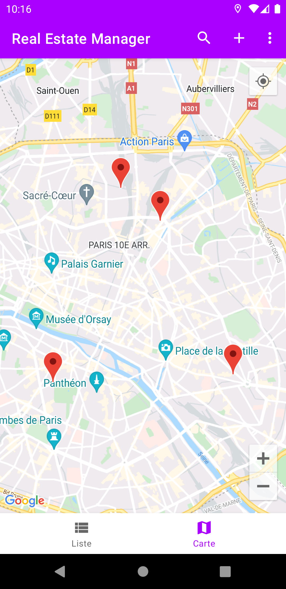
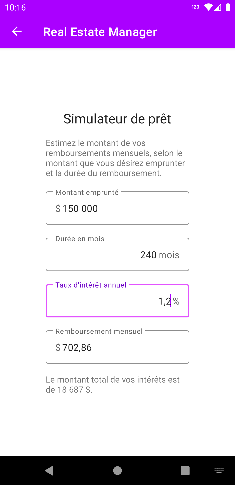
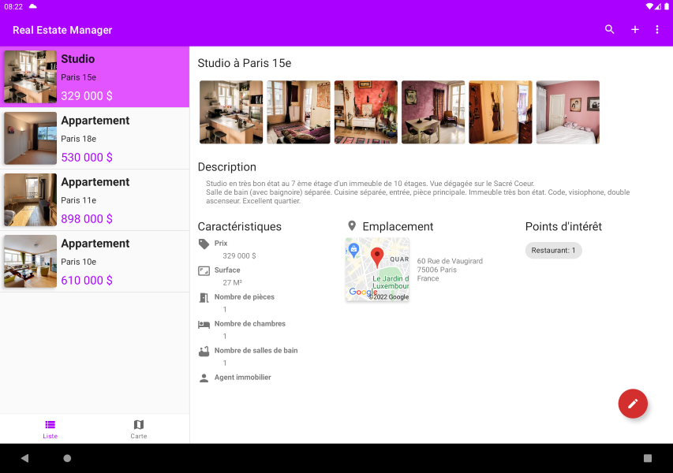

# RealEstateManager

Application du 9ème projet du parcours OpenClassrooms « Développeur d’application - Android » 

## Description

Il s’agit d’une application de gestion de biens immobiliers à destination d’un agent immobilier. Elle se présente sous la forme d’une liste d’annonces. En cliquant sur un élément de la liste, on peut afficher tous les détails concernant le bien immobilier, notamment une liste de points d’intérêt à proximité. L’agent peut ajouter de nouvelles annonces ou modifier celles existantes. Une carte est également présente pour situer les biens, ainsi qu’un simulateur de prêt immobilier.

## Compétences mises en œuvre

- Codée entièrement en **Kotlin**
- Architecture **MVVM**
- Les données sont stockées en local dans une base de données SQLite utilisant la bibliothèque **ROOM**
- Utilise le service **Google Maps** pour afficher la carte
- **Retrofit** est utilisé pour les appels réseau, notamment à l’API **Google Places** pour le Géocoding et les centres d’intérêt
- L’asynchronicité est gérée avec des **coroutines Kotlin**
- Suit les **Material Design Guidelines**

## Aperçu de l’application

### Sur téléphone

   

### Sur tablette

